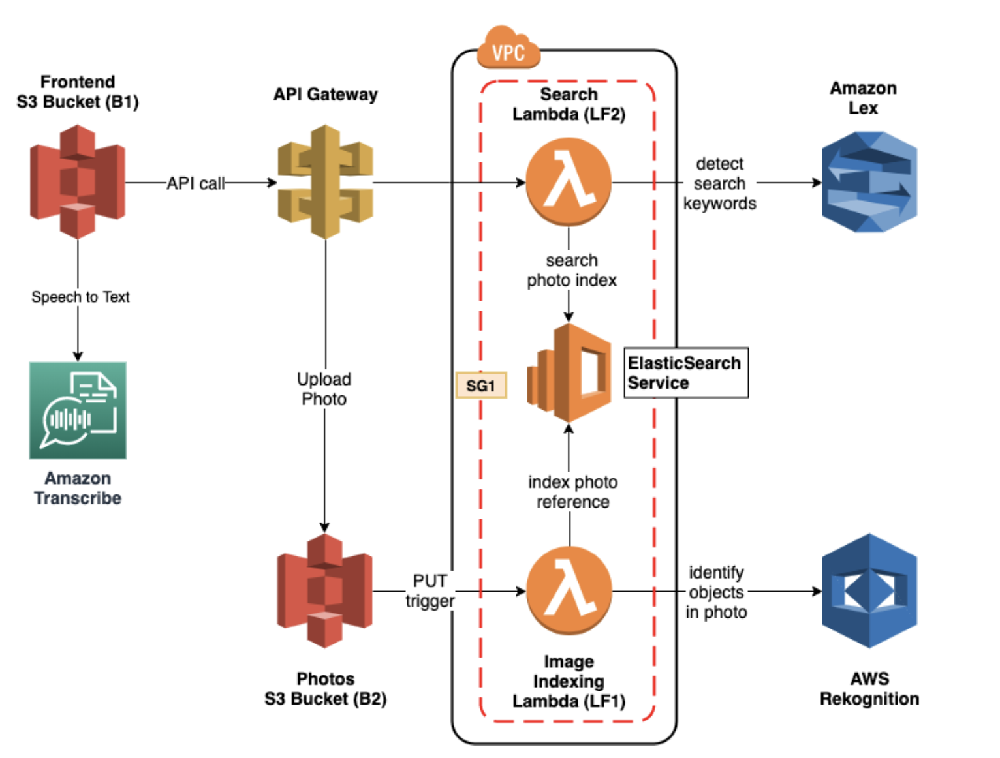

# Cloud Computing & Big Data: Assignment 2: Voice Enabled Photo Album #
### I Hun Chan & Taku Takamatsu ###

## About ##

Project repository for COMS6998: Cloud Computing & Big Data course, Assignment #2. We implemented a serverless, microservice-driven web app which allows for photo uploads and can be searched using natural language through both text and voice.

Core features of this project include:
1. User accesses front-end website hosted on AWS S3; Amazon Transcribe is used via Amplify to transcribe audio into text.
2. API gateway is used by the front-end to communicate with backend with GET and PUT endpoints.
3. Lambda function (LF1) is triggered when a user uploads photos from the front-end. The image is passed through Amazon Rekognition to detect labels in the image, and stores them in an Open Search instance.
4. OpenSearch instance creates indexes on uploaded photos with appended labels.
5. Lex bot parses text in the searches.
6. Lambda function (LF2), given a query/search term from the front-end, disambiguates the query through the Lex bot, and searches the OpenSearch index for results.
7. AWS CodePipeline for continuous CI/CD
8. AWS CloudFormation stack to represent project infrastructure.

## Website Link ##

Sample Architecture (From Assignment): 

